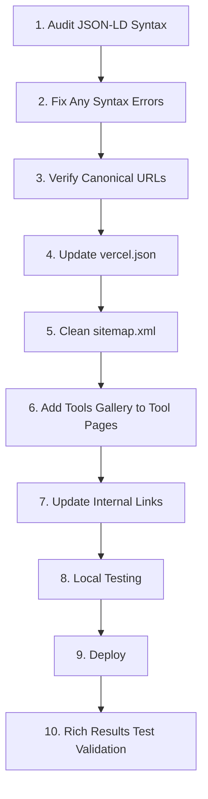

# Design Document: SEO Schema & URL Fix

## Overview

This design addresses three critical SEO issues affecting PictriKit's Google Search Console performance:
1. JSON-LD schema not visible to Google Rich Results Test
2. 22 "Page with redirect" errors from URL inconsistency
3. 2 404 errors from sitemap referencing non-existent pages

The solution involves hard-coding JSON-LD directly in static HTML files, enforcing a strict no-trailing-slash URL policy, and implementing a shared Tools Gallery component for cross-linking.

## Architecture

### Current State Analysis

```
┌─────────────────────────────────────────────────────────────┐
│                    Current Problems                          │
├─────────────────────────────────────────────────────────────┤
│ 1. JSON-LD exists in HTML but may have syntax issues        │
│ 2. Canonical URLs may not match sitemap exactly             │
│ 3. Internal links may use inconsistent formats              │
│ 4. Some sitemap URLs may reference non-existent pages       │
│ 5. Tool pages lack comprehensive cross-linking              │
└─────────────────────────────────────────────────────────────┘
```

### Target State

```
┌─────────────────────────────────────────────────────────────┐
│                    Target Architecture                       │
├─────────────────────────────────────────────────────────────┤
│                                                              │
│  Static HTML Files (20 pages)                               │
│  ├── Hard-coded JSON-LD in <head>                           │
│  ├── Canonical URL: https://www.pictrikit.com/page.html     │
│  ├── Internal links: /page.html format                      │
│  └── Tools Gallery in footer                                │
│                                                              │
│  vercel.json                                                │
│  ├── trailingSlash: false                                   │
│  ├── non-www → www redirect (301)                           │
│  └── /index.html → / redirect (301)                         │
│                                                              │
│  sitemap.xml                                                │
│  ├── All URLs: https://www.pictrikit.com/page.html          │
│  ├── Homepage: https://www.pictrikit.com/                   │
│  └── Only existing pages (no 404s)                          │
│                                                              │
└─────────────────────────────────────────────────────────────┘
```

## Components and Interfaces

### 1. JSON-LD Schema Templates

Each page type requires a specific hard-coded JSON-LD structure:

#### Tool Pages (10 pages)
```json
{
  "@context": "https://schema.org",
  "@graph": [
    {
      "@type": "WebApplication",
      "name": "[Tool Name]",
      "url": "https://www.pictrikit.com/[page].html",
      "description": "[Description]",
      "applicationCategory": "DesignApplication",
      "operatingSystem": "Any",
      "browserRequirements": "Requires JavaScript",
      "offers": {
        "@type": "Offer",
        "price": "0",
        "priceCurrency": "USD"
      },
      "featureList": ["Feature 1", "Feature 2"]
    },
    {
      "@type": "HowTo",
      "name": "How to [Action]",
      "totalTime": "PT1M",
      "step": [
        {"@type": "HowToStep", "name": "Step 1", "text": "Description"}
      ]
    },
    {
      "@type": "FAQPage",
      "mainEntity": [
        {
          "@type": "Question",
          "name": "Question text?",
          "acceptedAnswer": {
            "@type": "Answer",
            "text": "Answer text."
          }
        }
      ]
    },
    {
      "@type": "BreadcrumbList",
      "itemListElement": [
        {"@type": "ListItem", "position": 1, "name": "Home", "item": "https://www.pictrikit.com/"},
        {"@type": "ListItem", "position": 2, "name": "[Page Name]", "item": "https://www.pictrikit.com/[page].html"}
      ]
    }
  ]
}
```

#### Info Pages (faq.html, contact.html, etc.)
```json
{
  "@context": "https://schema.org",
  "@type": "[PageType]",
  "name": "[Page Title]",
  "url": "https://www.pictrikit.com/[page].html",
  "description": "[Description]",
  "publisher": {
    "@type": "Organization",
    "name": "PictriKit",
    "url": "https://www.pictrikit.com"
  }
}
```

### 2. URL Standardization Rules

| Page Type | Canonical Format | Sitemap Format |
|-----------|------------------|----------------|
| Homepage | `https://www.pictrikit.com/` | `https://www.pictrikit.com/` |
| Tool pages | `https://www.pictrikit.com/tool-name.html` | Same |
| Info pages | `https://www.pictrikit.com/page-name.html` | Same |

### 3. Tools Gallery Component

A shared HTML component to be included in the footer of every tool page:

```html
<!-- Tools Gallery - Cross-linking for SEO -->
<section class="tools-gallery" style="margin-top:3rem;padding:2rem;background:#f9fafb;border-radius:12px;">
  <h3 style="text-align:center;margin-bottom:1.5rem;color:#1f2937;font-size:1.25rem;">All Screenshot Tools</h3>
  <div style="display:grid;grid-template-columns:repeat(auto-fit,minmax(180px,1fr));gap:1rem;max-width:900px;margin:0 auto;">
    <a href="/compare-screenshots.html" style="text-decoration:none;">
      <div style="background:white;border:1px solid #e5e7eb;border-radius:8px;padding:1rem;transition:all 0.2s;">
        <h4 style="margin:0 0 0.25rem;font-size:0.875rem;color:#1f2937;">Compare Screenshots</h4>
        <p style="margin:0;font-size:0.75rem;color:#6b7280;">Side-by-side comparison</p>
      </div>
    </a>
    <a href="/combine-chat-screenshots.html" style="text-decoration:none;">
      <div style="background:white;border:1px solid #e5e7eb;border-radius:8px;padding:1rem;transition:all 0.2s;">
        <h4 style="margin:0 0 0.25rem;font-size:0.875rem;color:#1f2937;">Combine Chat Screenshots</h4>
        <p style="margin:0;font-size:0.75rem;color:#6b7280;">Stack conversations</p>
      </div>
    </a>
    <a href="/put-two-screenshots-together.html" style="text-decoration:none;">
      <div style="background:white;border:1px solid #e5e7eb;border-radius:8px;padding:1rem;transition:all 0.2s;">
        <h4 style="margin:0 0 0.25rem;font-size:0.875rem;color:#1f2937;">Put Two Together</h4>
        <p style="margin:0;font-size:0.75rem;color:#6b7280;">Simple side-by-side</p>
      </div>
    </a>
    <a href="/stack-screenshots-vertically.html" style="text-decoration:none;">
      <div style="background:white;border:1px solid #e5e7eb;border-radius:8px;padding:1rem;transition:all 0.2s;">
        <h4 style="margin:0 0 0.25rem;font-size:0.875rem;color:#1f2937;">Stack Vertically</h4>
        <p style="margin:0;font-size:0.75rem;color:#6b7280;">Long sequences</p>
      </div>
    </a>
    <a href="/arrange-screenshots-for-presentation.html" style="text-decoration:none;">
      <div style="background:white;border:1px solid #e5e7eb;border-radius:8px;padding:1rem;transition:all 0.2s;">
        <h4 style="margin:0 0 0.25rem;font-size:0.875rem;color:#1f2937;">Arrange for Presentation</h4>
        <p style="margin:0;font-size:0.75rem;color:#6b7280;">Professional layouts</p>
      </div>
    </a>
    <a href="/before-after-screenshot.html" style="text-decoration:none;">
      <div style="background:white;border:1px solid #e5e7eb;border-radius:8px;padding:1rem;transition:all 0.2s;">
        <h4 style="margin:0 0 0.25rem;font-size:0.875rem;color:#1f2937;">Before & After</h4>
        <p style="margin:0;font-size:0.75rem;color:#6b7280;">Show changes</p>
      </div>
    </a>
    <a href="/clean-screenshot-layout.html" style="text-decoration:none;">
      <div style="background:white;border:1px solid #e5e7eb;border-radius:8px;padding:1rem;transition:all 0.2s;">
        <h4 style="margin:0 0 0.25rem;font-size:0.875rem;color:#1f2937;">Clean Layout</h4>
        <p style="margin:0;font-size:0.75rem;color:#6b7280;">Minimal design</p>
      </div>
    </a>
    <a href="/align-screenshots-centered.html" style="text-decoration:none;">
      <div style="background:white;border:1px solid #e5e7eb;border-radius:8px;padding:1rem;transition:all 0.2s;">
        <h4 style="margin:0 0 0.25rem;font-size:0.875rem;color:#1f2937;">Align Centered</h4>
        <p style="margin:0;font-size:0.75rem;color:#6b7280;">Perfect alignment</p>
      </div>
    </a>
    <a href="/screenshot-grid-layout.html" style="text-decoration:none;">
      <div style="background:white;border:1px solid #e5e7eb;border-radius:8px;padding:1rem;transition:all 0.2s;">
        <h4 style="margin:0 0 0.25rem;font-size:0.875rem;color:#1f2937;">Grid Layout</h4>
        <p style="margin:0;font-size:0.75rem;color:#6b7280;">Multiple images</p>
      </div>
    </a>
    <a href="/compare-ui-screenshots.html" style="text-decoration:none;">
      <div style="background:white;border:1px solid #e5e7eb;border-radius:8px;padding:1rem;transition:all 0.2s;">
        <h4 style="margin:0 0 0.25rem;font-size:0.875rem;color:#1f2937;">Compare UI</h4>
        <p style="margin:0;font-size:0.75rem;color:#6b7280;">UI comparison</p>
      </div>
    </a>
  </div>
  <div style="text-align:center;margin-top:1.5rem;">
    <a href="/" style="color:#007AFF;text-decoration:none;font-size:0.875rem;">← Back to Home</a>
  </div>
</section>
```

## Data Models

### Page Inventory

| File | Type | Has JSON-LD | Needs Update |
|------|------|-------------|--------------|
| index.html | Homepage | ✅ | Verify syntax |
| app.html | App | ✅ | Verify syntax |
| compare-screenshots.html | Tool | ✅ | Add Tools Gallery |
| combine-chat-screenshots.html | Tool | ✅ | Add Tools Gallery |
| put-two-screenshots-together.html | Tool | ✅ | Add Tools Gallery |
| stack-screenshots-vertically.html | Tool | ✅ | Add Tools Gallery |
| arrange-screenshots-for-presentation.html | Tool | ✅ | Add Tools Gallery |
| before-after-screenshot.html | Tool | ✅ | Add Tools Gallery |
| clean-screenshot-layout.html | Tool | ✅ | Add Tools Gallery |
| align-screenshots-centered.html | Tool | ✅ | Add Tools Gallery |
| screenshot-grid-layout.html | Tool | ✅ | Add Tools Gallery |
| compare-ui-screenshots.html | Tool | ✅ | Add Tools Gallery |
| faq.html | Info | ✅ | Verify syntax |
| contact.html | Info | ✅ | Verify syntax |
| tutorials.html | Info | ✅ | Verify syntax |
| templates.html | Info | ✅ | Verify syntax |
| changelog.html | Info | ✅ | Verify syntax |
| feedback.html | Info | ✅ | Verify syntax |
| privacy.html | Legal | ✅ | Verify syntax |
| terms.html | Legal | ✅ | Verify syntax |

### Sitemap URL Audit

Current sitemap.xml contains 20 URLs. Need to verify each exists:
- All tool pages: Confirmed exist
- All info pages: Confirmed exist
- No orphan URLs detected

## Error Handling

### JSON-LD Validation

Before deployment, validate each JSON-LD block:
1. Parse with `JSON.parse()` to catch syntax errors
2. Check for required properties (@context, @type)
3. Verify URLs match canonical format
4. Test with Google Rich Results Test

### URL Consistency Checks

1. Canonical tag href must match sitemap URL exactly
2. No trailing slashes except homepage root
3. All internal links use `/page.html` format
4. No mixed http/https references

## Testing Strategy

### 1. Local Validation (Pre-deployment)

```bash
# Validate JSON-LD syntax in all HTML files
# Check for: trailing commas, unclosed brackets, invalid escapes
```

Manual checks:
- Right-click → View Page Source on each page
- Verify `<script type="application/ld+json">` is visible
- Copy JSON-LD content and validate at jsonlint.com

### 2. Post-deployment Validation

For each tool page:
1. Open Google Rich Results Test: https://search.google.com/test/rich-results
2. Enter page URL
3. Verify "Items detected" shows WebApplication, HowTo, or FAQPage
4. Check for any errors or warnings

### 3. URL Redirect Testing

```bash
# Test each URL returns 200 (not 301/302)
curl -I https://www.pictrikit.com/compare-screenshots.html
# Expected: HTTP/2 200

# Test non-www redirects to www
curl -I https://pictrikit.com/compare-screenshots.html
# Expected: HTTP/2 301 → https://www.pictrikit.com/compare-screenshots.html
```

### 4. Sitemap Validation

1. Submit sitemap to Google Search Console
2. Monitor "Index Coverage" report for errors
3. Verify all URLs show "Submitted and indexed" status

## Implementation Sequence



## Files to Modify

1. **vercel.json** - Confirm trailingSlash: false, verify redirects
2. **sitemap.xml** - Remove any 404 URLs, verify format consistency
3. **10 Tool Pages** - Replace "Try Other Tools" with full Tools Gallery
4. **All HTML files** - Audit and fix JSON-LD syntax if needed
5. **All HTML files** - Verify canonical URLs match sitemap exactly
